<div align="center">

# 👋 Hi, I'm Smitha U M

### CSE Undergraduate • DevOps Engineer Intern • Frontend Developer

Building practical software, exploring cloud infrastructure, and turning ideas into real-world applications.

[](https://github.com/smithaum)
[](https://www.linkedin.com/)

</div>

---

## About Me

```text
$ whoami

CSE undergraduate with a strong interest in:
→ DevOps & Cloud Infrastructure
→ Frontend Development & UI/UX
→ Automation, APIs & Developer Tools
→ Machine Learning projects

Currently:
→ DevOps Engineer Intern @ QSpiders
→ Building projects and improving my problem-solving skills
→ Learning by shipping, debugging, and iterating
```

## Tech Stack

### Languages
    

### Frontend & Backend
    

### DevOps & Cloud
      

### Databases & Tools
   

---

## Featured Projects

### 🌱 GitGarden
A GitHub ecosystem dashboard concept focused on making repository activity more visual and engaging.

**Focus:** GitHub API • React • UI/UX • Developer Experience

### 💰 Budget Beam
A MERN-based budget tracker designed to make personal finance tracking simple and visual.

**Stack:** MongoDB • Express • React • Node.js

### 🌾 Crop Yield Analysis & Prediction
A web project combining soil and weather information with machine-learning-based crop yield prediction.

**Focus:** ML • Python • Web Development • Data Analysis

### 🎙️ Speech Emotion Recognition
Deep-learning project using LSTM networks to classify emotions from speech.

**Stack:** Python • TensorFlow/Keras • Librosa • RAVDESS

---

## DevOps Journey

```text
Linux
  ↓
Git & GitHub
  ↓
Docker
  ↓
Jenkins / CI-CD
  ↓
AWS & Cloud
  ↓
Kubernetes
  ↓
Automation & Infrastructure
```

Currently strengthening my hands-on knowledge of Linux administration, Docker, Jenkins, Kubernetes, AWS, CI/CD, and cloud infrastructure.

## Experience

| Role | Organization | Focus |
|---|---|---|
| DevOps Engineer Intern | QSpiders | DevOps, Cloud & Infrastructure |
| Web Development Intern | Zaalima Development Pvt. Ltd. | Web Development |
| UI/UX Design Intern | Cognifyz Technologies | UI/UX |
| Graphic Design Intern | SkillCraft Technology | Visual Design |
| Web Development Intern | Vanillakart | Web Development |

---

## Virtual Experience

Hands-on virtual experiences and simulations completed through **Forage**, covering software engineering, cloud technology, data analytics, risk, and GenAI.

| Company | Virtual Experience | Focus |
|---|---|---|
| JPMorgan Chase & Co. | Software Engineering | Kafka • Spring Boot • REST APIs • JPA • H2 |
| Wells Fargo | Software Engineering | ERD • Database Design • IntelliJ |
| Goldman Sachs | Risk | Credit Risk Analysis |
| Tata | GenAI Powered Data Analytics | EDA • GenAI • Predictive Analytics |
| Skyscanner | Software Engineering | Dropwizard • Microservices • Android |
| Commonwealth Bank | Tech Explorer | Technology Exploration |

---

## GitHub Activity

<div align="center">

</div>

## Currently Learning

- DevOps & CI/CD
- Kubernetes & container orchestration
- AWS & cloud infrastructure
- Linux administration
- System design fundamentals
- DSA & problem solving

## Let's Connect

I'm interested in opportunities involving **DevOps, Cloud, Frontend Development, and Software Engineering**.

<p align="center">
  <a href="https://github.com/smithaum">GitHub</a> •
  <a href="https://www.linkedin.com/">LinkedIn</a>
</p>

<div align="center">

### <code>Build → Break → Debug → Learn → Repeat</code>

</div>